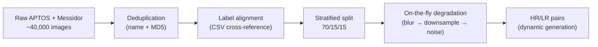
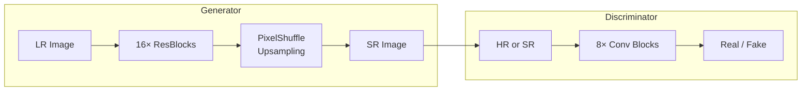

# GAN-based Retinal Image Super-Resolution

<p align="center">
  <strong>Enhancing retinal fundus image resolution using Generative Adversarial Networks</strong><br>
  <em>Accessible medical imaging through computational super-resolution</em>
</p>

<p align="center">
  
  
  
  
  
</p>

---

## Table of Contents

- [Overview](#overview)
- [Dataset](#dataset)
- [Methodology](#methodology)
  - [Super-Resolution (SRGAN)](#super-resolution-srgan)
  - [Classification (VGG16)](#classification-vgg16)
  - [Experimental Design](#experimental-design)
- [Key Results](#key-results)
  - [SRGAN Performance](#srgan-performance)
  - [Classification Performance](#classification-performance)
- [Repository Structure](#repository-structure)
- [Installation](#installation)
- [Usage](#usage)
- [Project Roadmap](#project-roadmap)
- [Documentation](#documentation)
- [Author](#author)

---

## Overview

### The Problem

Low-cost medical imaging devices often produce low-resolution images due to hardware constraints. In retinal diagnostics, this limits the ability to detect early signs of diabetic retinopathy — a leading cause of preventable blindness worldwide.

### The Solution

This project leverages **Generative Adversarial Networks (GANs)** to computationally enhance retinal fundus images, enabling high-quality diagnostics from affordable imaging hardware. By applying super-resolution techniques originally developed for natural images, we demonstrate significant quality improvements on medical fundus photography.

### Key Contributions

- **SRGAN-based super-resolution** for retinal fundus images across 9 degradation scenarios (3 degradation levels × 3 scale factors)
- **Full adversarial SRGAN (srgan-full)** with WeightNorm Generator + SpectralNorm Discriminator + Perceptual/Adversarial/Edge losses for perceptually optimized reconstruction
- **Diagnostic preservation evaluation** — validates whether SR images preserve clinical information using ResNet50 ordinal and VGG16 classifiers
- **Best SR performance (baseline):** PSNR **37.43 dB**, SSIM **0.944** at ×2 magnification
- **Transfer learning classifier** achieving **64.43% accuracy** on 5-class diabetic retinopathy grading
- **Training resume system** — `training_progress.json` prevents wasted compute on interrupted runs
- **Comprehensive degradation pipeline** simulating real-world camera optics (blur → downsample → noise)
- **Full documentation** of methodology, results, and future work

---

## Dataset

### Source

**Kaggle:** [Binary Classification Data — APTOS and Messidor](https://www.kaggle.com/datasets/anikbhowmickae20b102/binary-classification-data-aptos-and-messidor)

Combines two major retinal image datasets:
- **APTOS** (Asia Pacific Tele-Ophthalmology Society)
- **Messidor** (French research program)

### Class Distribution

| DR Severity | Label | Samples | Percentage |
|:-----------:|:-----:|:-------:|:----------:|
| No DR | 0 | 1,804 | 50.4% |
| Mild | 1 | 350 | 9.8% |
| Moderate | 2 | 954 | 26.7% |
| Severe | 3 | 182 | 5.1% |
| Proliferative | 4 | 288 | 8.0% |

### Preprocessing Pipeline



**Key decision:** HR images are stored; all degradations are applied dynamically during training to ensure reproducibility and prevent data leakage.

---

## Methodology

### Super-Resolution (SRGAN)

Two architectures were developed:

#### Full SRGAN (Baseline Design)

| Component | Architecture | Parameters |
|-----------|-------------|:----------:|
| **Generator** | SRResNet: 16× ResBlocks + PixelShuffle upsampling | ~1.55M (×4) |
| **Discriminator** | 8× Conv-BN-LeakyReLU blocks + classifier head | ~2.8M |
| **Loss** | Content (VGG-19 relu3_3) + Adversarial + L1 | — |



#### Simplified SRGAN (srgan2 — Trained)

Due to GPU constraints (GTX 1650, 4 GB VRAM), a lighter architecture was used for full training:

```python
nn.Sequential(
    Conv2d(3, 64, 3) → ReLU,
    Conv2d(64, 64, 3) → ReLU,
    Conv2d(64, 3 × scale², 3),
    PixelShuffle(scale),
)
```

**Loss:** L1 only | **Optimizer:** Adam (lr=1×10⁻⁴) | **Epochs:** 3 | **Batch size:** 4

#### Full Adversarial SRGAN (srgan-full)

Full GAN training with generator, discriminator, perceptual loss, and adversarial training for perceptually optimized super-resolution.

**Architecture:**

| Component | Type | Details | Parameters (×4) |
|-----------|------|---------|:----------------:|
| **Generator** | SRResNet (4 ResBlocks) | WeightNorm, PixelShuffle upsampling, Tanh output, global skip connection | ~0.66M |
| **Discriminator** | VGG-style (7 blocks) | SpectralNorm, LeakyReLU(0.2), AdaptiveAvgPool2d(1) — input-size agnostic | ~2.1M |
| **Perceptual Loss** | VGG-19 (relu3_3) | Frozen ImageNet weights, interpolates LR → 224px | — |
| **Adversarial Loss** | BCEWithLogits | Label smoothing 0.9/0.1 for stable GAN training | — |
| **Edge Loss** | Sobel gradients | L1 on edge maps — preserves high-frequency details | — |

```
Generator:
  Head:    Conv2d(3, 64, 9) → PReLU
  Body:    4× [Conv2d(64,64,3) → PReLU → Conv2d(64,64,3)]  (WeightNorm + skip)
  Upsample: [Conv2d(64, 256, 3) → PixelShuffle(2) → PReLU] × log₂(scale)
  Tail:    Conv2d(64, 3, 9) → Tanh

Discriminator:
  7× [SpectralNorm(Conv2d) → LeakyReLU(0.2)]  (channels: 64→64→128→128→256→256→256)
  AdaptiveAvgPool2d(1) → Linear(256, 1024) → LeakyReLU(0.2) → Linear(1024, 1)
```

**Training optimizations (GTX 1650 4GB):**

| Technique | Benefit |
|-----------|---------|
| AMP (Mixed Precision) | 2-3× faster training, -40% VRAM |
| Batch size 4 + 96px patches | Fits 4GB VRAM |
| OneCycleLR | Converges in ~3-5 epochs |
| Multi-scale random crops | Forces spatial robustness |
| GAN training resume | `training_progress.json` skips completed models |

**Stability fixes for GAN convergence:**

| Fix | Problem | Solution |
|-----|---------|----------|
| NaN protection | NaN from exploding gradients → corrupted weights | `torch.nan_to_num` on forward/gradients/losses + `clip_grad_norm` |
| BatchNorm removal | BatchNorm with batch=4 creates unstable gradients for GAN | SpectralNorm only in discriminator |
| Noise injection | Discriminator overfits to subtle generator artifacts | `x + randn_like(x) × 0.05` in D forward during training |
| D update interval | Discriminator dominates generator | D updated every 4 G steps (instead of every 2) |
| ×2 capacity | Generator too weak for ×2 adversarial training | 8 ResBlocks for ×2 models (vs 4 for ×4/×8) |
| D channel reduction | 10:1 parameter imbalance D:G | Max D channels reduced from 512→256 (~2:1 ratio) |

### Classification (VGG16)

A VGG16 pre-trained on ImageNet was adapted for DR severity grading:

```
VGG16 (frozen convolutional features)
    ↓
Classifier: Linear(25088, 4096) → ReLU → Dropout(0.5)
          → Linear(4096, 4096) → ReLU → Dropout(0.5)
          → Linear(4096, 5)
```

- **Loss:** Weighted CrossEntropyLoss (inverse frequency weights)
- **Optimizer:** Adam (lr=1×10⁻⁴, classifier only)
- **Training time:** 104 minutes
- **Key finding:** Frozen features outperformed fine-tuning (64.43% vs 62.76%) due to limited training data

### Experimental Design

**9 models** exploring the interaction between degradation level and scale factor:

| | ×2 | ×4 | ×8 |
|---|:---:|:---:|:---:|
| **A — Standard** (Bicubic, σ=1.0, σₙ=5) | M1 | M2 | M3 |
| **B — Moderate** (Bilinear, σ=1.5, σₙ=10) | M4 | M5 | M6 |
| **C — Severe** (Lanczos, σ=2.0, Poisson) | M7 | M8 | M9 |

[Full experimental design details →](docs/technical/experimental-design.md)

### Diagnostic Preservation Evaluation

Evaluates whether SRGAN super-resolved images preserve diagnostic information for Diabetic Retinopathy grading by comparing classifier performance on original HR vs SR-reconstructed images.

**Pipeline:**
```
Original HR → Degrade (blur+downsample+noise) → SRGAN Generator → SR image
                                                                        ↓
Original HR ──────────────────────────────────────────────────────→ Classifier (×2)
                                                                      ├─ ResNet50 ordinal (QWK=0.8764)
                                                                      └─ VGG16 CE (Acc=64.43%)
```

**Models evaluated:**
- **srgan2, srgan31, srgan32** — 27 baseline SR models (3-layer Conv + PixelShuffle)
- **srgan-full** — 9 full adversarial SR models (pending training completion)

**Metrics:**
- Quadratic Weighted Kappa (QWK) — primary metric (ordinal DR grading)
- Accuracy, Precision/Recall/F1, Sensitivity, Specificity

**Classifier pipelines:**

| Classifier | Preprocessing | Training | Baseline Performance |
|-----------|--------------|----------|:--------------------:|
| **ResNet50 ordinal** | Random crop 224 + contrast + ImageNet norm | Ordinal regression with QWK-optimized thresholds | QWK **0.8764** |
| **VGG16 CE** | Resize 224 + ToTensor + ImageNet norm | Cross-entropy with frozen features | Acc **64.43%** |

**Status:** Notebook created (inference-only, `notebooks/evaluation/diagnostic-preservation.ipynb`). Execution blocked until srgan-full training checkpoint are available. srgan2/srgan31/srgan32 checkpoints are ready for immediate evaluation.

---

## Key Results

### SRGAN Performance (srgan2 Baseline)

Results from the simplified SRGAN (srgan2 — L1 loss only, 3-layer generator).

| Model | PSNR (dB) ↑ | SSIM ↑ | LPIPS ↓ | Best For |
|:-----:|:----------:|:------:|:-------:|----------|
| **M4** | **37.43** | **0.944** | **0.043** | Best overall (×2, Bilinear) |
| M1 | 35.19 | 0.922 | 0.060 | Standard scenario (×2) |
| M5 | 32.01 | 0.860 | 0.138 | Moderate scenario (×4) |
| M8 | 31.20 | 0.855 | 0.171 | Severe scenario (×4) |
| M2 | 30.84 | 0.817 | 0.206 | Standard scenario (×4) |
| M6 | 27.49 | 0.729 | 0.414 | Moderate scenario (×8) |
| M9 | 27.52 | 0.765 | 0.410 | Severe scenario (×8) |

[Full results →](docs/technical/results.md)

**Key findings:**
- ×2 models achieve **excellent** reconstruction (avg PSNR > 35 dB, SSIM > 0.92)
- ×4 models achieve **good** reconstruction (avg PSNR > 30 dB, SSIM > 0.80)
- Scenario B (Bilinear) **consistently outperforms** Bicubic and Lanczos — smoother LR inputs are easier to reconstruct

### SRGAN-ft (srgan-full) Performance

*Results pending — training in progress.* Full adversarial training (Generator + Discriminator + Perceptual Loss) across 9 models.

**Preliminary observations (epoch 1 of 3):**

| Model | Scale | Scenario | PSNR (dB) | LPIPS | Status |
|:-----:|:-----:|:--------:|:---------:|:-----:|--------|
| M1 | ×2 | A | 3.63 | NaN | ❌ Collapsed — D_real=1.0 fixed; retraining with 8 ResBlocks + noise injection + D@256ch |
| M2 | ×4 | A | 22.67 | 0.517 | ✅ Training stable (interrupted before completion) |
| M3 | ×8 | A | — | — | ⏳ Pending |
| M4 | ×2 | B | — | — | ❌ Same ×2 collapse as M1; retraining with fixes |
| M5 | ×4 | B | — | — | ⏳ Pending |
| M6 | ×8 | B | — | — | ⏳ Pending |
| M7 | ×2 | C | — | — | ❌ Same ×2 collapse as M1; retraining with fixes |
| M8 | ×4 | C | — | — | ⏳ Pending |
| M9 | ×8 | C | — | — | ⏳ Pending |

**Expected trade-off:** srgan-full sacrifices pixel accuracy (lower PSNR than srgan2) in exchange for **significantly lower LPIPS** (better perceptual quality) — the core benefit of adversarial super-resolution.

### Diagnostic Preservation Results

*Results pending — requires valid srgan-full checkpoints.*

| Model Family | Models | ResNet50 QWK | VGG16 Acc | Diagnosis Preserved? |
|:------------:|:------:|:------------:|:---------:|:--------------------:|
| srgan2 (×2) | 3 | ⏳ Pending | ⏳ Pending | — |
| srgan2 (×4) | 3 | ⏳ Pending | ⏳ Pending | — |
| srgan2 (×8) | 3 | ⏳ Pending | ⏳ Pending | — |
| srgan-full | 9 | ⏳ Pending | ⏳ Pending | — |

**Methodology:** For each model, HR test images are degraded, super-resolved, then classified. QWK/Acc difference between HR (baseline) and SR indicates diagnostic preservation. A small or zero drop confirms that SR images retain clinical utility.

### Classification Performance

| Model | Accuracy | Best For |
|-------|:--------:|----------|
| **Frozen VGG16** | **64.43%** | Limited data scenarios |
| Fine-tuned VGG16 | 62.76% | Larger datasets |
| Ensemble | 63.31% | Stability |

**Primary limitation:** Class imbalance (50:1 ratio between healthy and minority DR stages)

---

## Repository Structure

```
ProyectoAvanzado2/
│
├── README.md                        ← This file — project overview
├── AGENTS.md                        ← Agent configuration (opencode/Claude)
├── CONTEXT.md                       ← Domain glossary for AI agents
│
├── notebooks/                       ← Jupyter notebooks (all experiments)
│   ├── srgan/                       → SRGAN training notebooks
│   │   └── srgan-full.ipynb         → Full adversarial SRGAN (9 models, GAN training)
│   ├── evaluation/                  → Evaluation notebooks
│   │   └── diagnostic-preservation.ipynb → DR classifier comparison (HR vs SR)
│   ├── data_exploration.ipynb       → Dataset exploration
│   ├── model_desing.ipynb           → Architecture design decisions
│   ├── model_preparation.ipynb      → Data cleaning and preprocessing
│   ├── SRGAN_model_implementation.ipynb → Full SRGAN implementation
│   ├── srgan2.ipynb                 → Simplified SRGAN (9 trained models)
│   ├── Transfer_learnig_prediction_DL_model.ipynb → VGG16 classification
│   └── models/                      → Trained model weights (.pth)
│       ├── classification/          → VGG16 classifiers
│       └── Super-resolution/        → SRGAN variants (srgan2, srgan31, srgan32, srgan-full)
│
├── scripts/                         ← Utility Python modules
│   ├── useful_functions.py          → CSV/image processing utilities
│   ├── download.py                  → Kaggle dataset downloader
│   └── calculos.py                  → Physics calculations (auxiliary)
│
├── data/                            ← Datasets (gitignored due to size)
│   ├── raw/                         → Original Kaggle download
│   └── processed/                   → Cleaned M3 dataset
│
└── docs/                            ← Detailed documentation
    ├── stages/                      → One document per development stage
    │   ├── 01-literature-review.md
    │   ├── 02-dataset-preparation.md
    │   ├── 03-baseline-model.md
    │   ├── 04-training-optimization.md
    │   ├── 05-evaluation.md
    │   ├── 06-system-integration.md
    │   └── 07-final-analysis.md
    ├── technical/                   → Architecture and results reference
    │   ├── experimental-design.md   → 9-model matrix explained
    │   └── results.md               → Full metrics tables
    ├── agents/                      → Agent workflow configuration
    ├── images/                      → Figures and diagrams
    └── adr/                         → Architecture Decision Records
```

---

## Installation

### Prerequisites

- Python 3.11+
- PyTorch 2.1+ (CUDA recommended)
- NVIDIA GPU with 4+ GB VRAM (optional, for GPU acceleration)

### Setup

```bash
# Clone the repository
git clone https://github.com/JuanAngel4/ProyectoAvanzado2.git
cd ProyectoAvanzado2

# Create virtual environment (recommended)
python -m venv venv
source venv/bin/activate  # Linux/Mac
.\venv\Scripts\activate    # Windows

# Install dependencies
pip install torch torchvision torchaudio --index-url https://download.pytorch.org/whl/cu118
pip install jupyter numpy opencv-python scikit-image lpips matplotlib kagglehub
```

### Dataset Download

```bash
# Option 1: Automated download
python scripts/download.py

# Option 2: Manual download from Kaggle
# 1. Go to: https://www.kaggle.com/datasets/anikbhowmickae20b102/binary-classification-data-aptos-and-messidor
# 2. Download and extract to data/raw/
```

---

## Usage

### Running Notebooks

```bash
jupyter notebook notebooks/
```

Key notebooks:
- **`notebooks/srgan/srgan-full.ipynb`** — Full adversarial SRGAN training (9 models, GAN + Perceptual Loss)
- **`notebooks/evaluation/diagnostic-preservation.ipynb`** — DR classifier comparison (inference-only, evaluates diagnostic preservation)
- **`srgan2.ipynb`** — Simplified SRGAN training (9 models, L1 loss)
- **`SRGAN_model_implementation.ipynb`** — Full SRGAN architecture baseline
- **`Transfer_learnig_prediction_DL_model.ipynb`** — VGG16 classification
- **`model_preparation.ipynb`** — Dataset preparation pipeline

#### Training Resume

srgan-full includes an automatic training resume system. When re-running the training cell after interruption:

1. `training_progress.json` is checked for previously completed models
2. Completed models are skipped automatically
3. Training resumes from the first incomplete model

To force a full retrain, delete the progress file:
```powershell
Remove-Item "models/Super-resolution/srgan-full/checkpoints/training_progress.json"
```

### Inference (from notebooks)

```python
# Load trained model
model = torch.load('notebooks/models/Super-resolution/srgan2/model_4.pth')

# Super-resolve an image
sr_image = model(lr_image.unsqueeze(0))
```

---

## Project Roadmap

| Stage | Description | Status |
|:-----:|-------------|:------:|
| 1 | Literature Review & Problem Definition | ✅ Complete |
| 2 | Dataset Preparation & Preprocessing | ✅ Complete |
| 3 | Baseline Model Implementation (SRGAN) | ✅ Complete |
| 4a | Simplified SRGAN Training (srgan2) — 9 models, L1 loss | ✅ Complete |
| 4b | Full Adversarial SRGAN Training (srgan-full) — GAN + perceptual loss | 🔄 In Progress (×2 collapse fix applied, retraining) |
| 5a | Quantitative Evaluation (srgan2) — PSNR, SSIM, LPIPS | ✅ Complete |
| 5b | Diagnostic Preservation Evaluation — classifier comparison | ⏳ Blocked (waiting srgan-full checkpoints) |
| 6 | System Integration & Scalability | ⏳ Pending |
| 7 | Final Analysis & Future Work | ⏳ Pending |

---

## Documentation

Each project stage is documented in detail:

| Stage | Document |
|:-----:|----------|
| 1 | [Literature Review](docs/stages/01-literature-review.md) |
| 2 | [Dataset Preparation](docs/stages/02-dataset-preparation.md) |
| 3 | [Baseline Model](docs/stages/03-baseline-model.md) |
| 4 | [Training & Optimization](docs/stages/04-training-optimization.md) |
| 5 | [Evaluation](docs/stages/05-evaluation.md) |
| 6 | [System Integration](docs/stages/06-system-integration.md) |
| 7 | [Final Analysis](docs/stages/07-final-analysis.md) |

**Technical references:**
- [Experimental Design](docs/technical/experimental-design.md) — 9-model matrix
- [Results](docs/technical/results.md) — Full metrics tables
- [GAN Stability Fixes](./docs/adr/gan-stability-fixes.md) — BatchNorm removal, noise injection, NaN protection rationale

---

## Author

**Juan Angel** — Physics Engineer | Data Science Specialist

[GitHub](https://github.com/JuanAngel4) — [LinkedIn](https://linkedin.com/in/juanangel) — gamezdiazjuanangel@gmail.com

---

<p align="center">
  <sub>Built with ❤️ for accessible medical imaging</sub>
</p>
