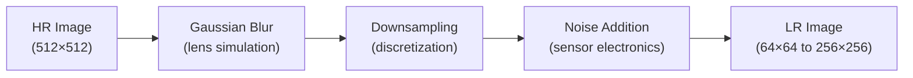

# Stage 2: Dataset Preparation and Preprocessing

**Status:** ✅ Complete

## Objective

Prepare the retinal fundus dataset for supervised super-resolution training. Build a reproducible pipeline for cleaning, unifying, and splitting the data.

---

## Dataset Sources

**Kaggle Dataset:** [Binary Classification Data — APTOS and Messidor](https://www.kaggle.com/datasets/anikbhowmickae20b102/binary-classification-data-aptos-and-messidor)

Combines two major retinal image datasets:
- **APTOS** (Asia Pacific Tele-Ophthalmology Society)
- **Messidor** (French research program)

### Label Schema (5-class DR severity)

| Class | Label | Description |
|-------|-------|-------------|
| 0 | No DR | Healthy retina |
| 1 | Mild | Mild non-proliferative DR |
| 2 | Moderate | Moderate non-proliferative DR |
| 3 | Severe | Severe non-proliferative DR |
| 4 | Proliferative | Proliferative DR |

---

## Raw Data Structure

```
data/raw/M1/
├── Aptos_messidor_dataset/      → 21,910 images
│   ├── class_0/ (10,384)         → No DR
│   └── class_1/ (11,526)         → DR Present
├── Train Images_new/             → 14,645 images
│   ├── class_0/ (7,220)
│   ├── class_1/ (7,425)
│   └── data_aptos_train.csv      → 5-class labels
└── Test Images_new/              → 3,665 images
    ├── class_0/ (1,805)
    ├── class_1/ (1,860)
    └── data_aptos_test.csv       → 5-class labels
```

**Total original images: ~40,220**

---

## Degradation Pipeline Design

A key design decision: **no degraded images are stored on disk**. All degradations are applied dynamically during training to ensure reproducibility and prevent data leakage.



### Degradation Parameters

| Method | Options | Selected | Rationale |
|--------|---------|----------|-----------|
| **Downsampling** | Bilinear, Bicubic, Lanczos | All three (per scenario) | Each represents different optical quality |
| **Blur** | Average, Gaussian, Median | Gaussian | Most realistic for optical sensor defocus |
| **Noise** | Gaussian, Salt-and-Pepper, Poisson | Gaussian & Poisson | Sensor electronics & photon noise |

---

## Dataset M3 Creation (Unified + Cleaned)

### Step 1: Unify class folders

Combined all class_0 and class_1 images into a single pool. Duplicate removal:
- **Name-based deduplication:** Same filename → kept once
- **Content-based deduplication:** MD5 hash comparison → removed content duplicates

**Results:**
- Train: 7,348 copied → 77 content duplicates removed → **7,219 unique images**
- Test: 1,805 + 1,854 = 3,659 → 6 content duplicates removed → **3,653 unique images**

### Step 2: Remove unlabeled images

Cross-referenced images against CSV label files. Removed images without matching CSV entries.

**Strategy:** Compare `id_code` column against image filenames (without extension).

```python
# From scripts/useful_functions.py
remove_unlabeled_images(csv_path, img_directory)
```

### Step 3: Final M3 dataset

```
data/processed/M3_diagnosis/
├── images/                         → 3,578 images (final clean set)
├── labels.csv                      → 3,662 rows
└── labels_cleaned.csv              → After removing labels without matching images
```

- **3,578 images** with verified labels
- ~2.3% label loss due to missing image files
- Final CSV columns: `['id_code', 'diagnosis']`

---

## Train/Validation/Test Split

**Strategy:** Stratified split preserving class distribution

| Split | Samples | Percentage |
|-------|---------|------------|
| Train | ~2,563 | 70% |
| Validation | ~549 | 15% |
| Test | ~550 | 15% |

**Split files:** `labels_train.csv`, `labels_val.csv`, `labels_test.csv`

---

## Tools Developed

The scripts used for data preparation are available at `scripts/useful_functions.py`:

| Function | Purpose |
|----------|---------|
| `how_many_files()` | Count images in directory |
| `csv_shape()` | Get CSV dimensions |
| `remove_unlabeled_images()` | Clean unlabeled images |
| `unify_images()` | Merge folders with deduplication |
| `unify_folders()` | Merge two folders |
| `merge_csv_files()` | Combine CSV label files |

---

## Deliverables

- Structured dataset pipeline ✓
- Preprocessing scripts ✓
- Dataset statistics and distribution analysis ✓
