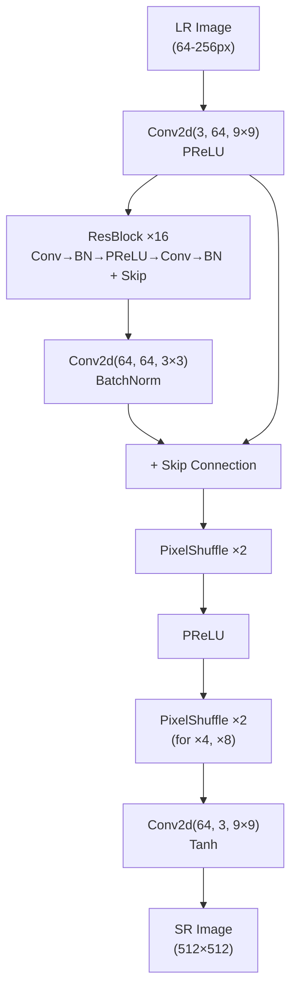

# Stage 3: Baseline Model Implementation

**Status:** ✅ Complete

## Objective

Implement the SRGAN architecture for retinal image super-resolution, including generator, discriminator, loss functions, and training pipeline.

---

## Generator: SRResNet

Based on Ledig et al. (2017) with architecture optimized for 512×512 RGB inputs.

### Architecture



### ResBlock Detail

```
Input (64 channels)
    ↓
Conv2d(64, 64, 3×3, padding=1)
    ↓
BatchNorm2d(64)
    ↓
PReLU(64)
    ↓
Conv2d(64, 64, 3×3, padding=1)
    ↓
BatchNorm2d(64)
    ↓
➕ (element-wise addition with input)
    ↓
Output (64 channels)
```

### Upsampling: PixelShuffle

Uses efficient sub-pixel convolution instead of transposed convolution to avoid checkerboard artifacts.

```python
# Single upsampling block
nn.Conv2d(64, 256, 3×3)          # Expand channels
nn.PixelShuffle(2)                 # Rearrange to 64 channels ×2 spatial
nn.PReLU(64)
```

### Parameter Count by Scale

| Scale | Upsampling Blocks | Parameters |
|-------|-------------------|------------|
| ×2 | 1× PixelShuffle | ~1.40M |
| ×4 | 2× PixelShuffle | ~1.55M |
| ×8 | 3× PixelShuffle | ~1.70M |

---

## Discriminator

Standard PatchGAN-style discriminator classifying real vs. generated HR patches.

### Architecture

```
Input (3×512×512)
    ↓
Conv2d(3, 64, 3×3, stride=1) → LeakyReLU(0.2)
    ↓
Conv2d(64, 64, 3×3, stride=2) → BatchNorm → LeakyReLU(0.2)
    ↓
Conv2d(64, 128, 3×3, stride=1) → BatchNorm → LeakyReLU(0.2)
    ↓
Conv2d(128, 128, 3×3, stride=2) → BatchNorm → LeakyReLU(0.2)
    ↓
Conv2d(128, 256, 3×3, stride=1) → BatchNorm → LeakyReLU(0.2)
    ↓
Conv2d(256, 256, 3×3, stride=2) → BatchNorm → LeakyReLU(0.2)
    ↓
Conv2d(256, 512, 3×3, stride=1) → BatchNorm → LeakyReLU(0.2)
    ↓
Conv2d(512, 512, 3×3, stride=2) → BatchNorm → LeakyReLU(0.2)
    ↓
AdaptiveAvgPool2d(1) → Flatten
    ↓
Linear(512, 1024) → LeakyReLU(0.2)
    ↓
Linear(1024, 1) → Sigmoid (Real/Fake)
```

---

## Loss Functions

The generator is trained with a three-component loss:

### 1. Content Loss (VGG Perceptual)

```python
# VGG-19 feature extraction at relu3_3 (layer 18)
vgg = models.vgg19(pretrained=True).features[:18]
content_loss = MSE(vgg(SR), vgg(HR))
```

**Weight:** λ_content = 1.0

**Purpose:** Measures semantic similarity in feature space rather than pixel space. This is what forces the generator to produce realistic textures rather than blurry averages.

### 2. Adversarial Loss

```python
adversarial_loss = BCEWithLogitsLoss(D(SR), real_labels)
```

**Weight:** λ_adv = 1×10⁻³

**Purpose:** Encourages the generator to produce images that the discriminator cannot distinguish from real HR images.

### 3. Pixel Loss (L1)

```python
pixel_loss = L1Loss(SR, HR)
```

**Weight:** λ_pixel = 1×10⁻²

**Purpose:** Maintains pixel-level fidelity to prevent the GAN from drifting too far from the ground truth.

### Total Generator Loss

```
L_G = 1.0 × L_content + 1×10⁻³ × L_adv + 1×10⁻² × L_pixel
```

---

## Training Protocol

### Two-Phase Training

**Phase 1: SRResNet Pretraining (5-10 epochs)**
- Train generator with L1 loss only
- Establishes stable pixel-level reconstruction
- Provides a good initialization for GAN training

**Phase 2: GAN Training (20 epochs)**
- Alternate discriminator and generator updates
- Discriminator learns to distinguish real from fake
- Generator learns perceptual quality

### Hyperparameters

| Parameter | Value |
|-----------|-------|
| Optimizer | Adam (β₁=0.9, β₂=0.999) |
| Learning rate (G) | 1×10⁻⁴ |
| Learning rate (D) | 1×10⁻⁴ |
| Batch size | 16 (debug: 4) |
| LR scheduler | StepLR (step=n_epochs/2, γ=0.1) |
| Image size | 512×512 (HR) |
| Normalization | [-1, 1] |
| Augmentation | Horizontal/vertical flip, 90° rotation |

### On-the-fly Dataset

```python
class SRDataset(Dataset):
    """Generates HR/LR pairs dynamically during training."""
    def __init__(self, hr_images, scale, degradation_params):
        self.hr_images = hr_images                 # 512×512 crops
        self.scale = scale
        self.degradation = degradation_params      # blur → downsample → noise
    
    def __getitem__(self, idx):
        hr = self.hr_images[idx]                   # Random 512×512 crop
        lr = self.degrade(hr)                      # → blur → downsample → noise
        return lr, hr
```

---

## Implementation Details

**Hardware:**
- GPU: NVIDIA GeForce GTX 1650 with Max-Q Design (4 GB VRAM)
- PyTorch 2.1.0+cu118, CUDA 11.8

**GPU Constraints:**
- Full SRGAN training was interrupted due to: ~4.9s/iteration, 1,611 batches/epoch, estimated ~2-4 hours per model on RTX 3080
- Required reducing batch size to 2 and limiting epochs
- Led to development of simplified `srgan2` architecture (see Stage 4)

---

## Deliverables

- Functional training script ✓
- Generator and discriminator architectures ✓
- Defined loss functions ✓
- Training pipeline ✓
