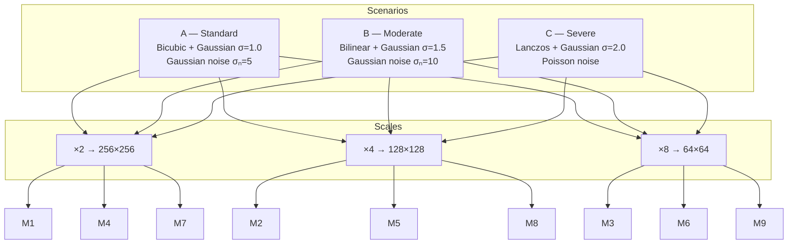
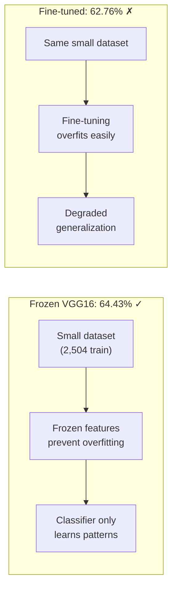

# Stage 4: Model Training and Optimization

**Status:** ✅ Complete

## Objective

Train and optimize the super-resolution model across multiple degradation scenarios. Train a transfer learning classifier for DR severity grading.

---

## Track A: Simplified SRGAN (srgan2)

The full SRGAN could not complete training due to GPU constraints. An optimized simplified architecture was developed.

### Simpler Generator

```python
nn.Sequential(
    nn.Conv2d(3, 64, kernel_size=3, padding=1),
    nn.ReLU(),
    nn.Conv2d(64, 64, kernel_size=3, padding=1),
    nn.ReLU(),
    nn.Conv2d(64, 3 * scale**2, kernel_size=3, padding=1),
    nn.PixelShuffle(scale),
)
```

- No residual blocks (lightweight for 4 GB VRAM)
- Pure convolutional → PixelShuffle pipeline
- Loss: L1 only (no GAN — faster convergence)

### Training Configuration

| Parameter | Value |
|-----------|-------|
| Batch size | 4 |
| Epochs per model | 3 |
| Optimizer | Adam, lr=1×10⁻⁴ |
| Dataset size | 3,578 images |
| Batches per epoch | 895 |
| Training time/model | ~30 min |

### Experimental Design: 9 Models



---

## Track B: VGG16 Transfer Learning (Classification)

### Dataset Split (Stratified)

| Split | Samples | Class 0 | Class 1 | Class 2 | Class 3 | Class 4 |
|-------|---------|---------|---------|---------|---------|---------|
| Train | 2,504 | 1,262 | 245 | 668 | 127 | 202 |
| Val | 537 | 271 | 52 | 143 | 28 | 43 |
| Test | 537 | 271 | 53 | 143 | 27 | 43 |
| **Total** | **3,578** | **1,804** | **350** | **954** | **182** | **288** |

### Model 1: Frozen Features (Baseline)

```
VGG16 (frozen conv features)
    ↓
Classifier: Linear(25088, 4096) → ReLU → Dropout(0.5)
          → Linear(4096, 4096) → ReLU → Dropout(0.5)
          → Linear(4096, 5)
```

**Training:**
- Optimizer: Adam, lr=1×10⁻⁴ (classifier only)
- Loss: Weighted CrossEntropyLoss (inverse frequency weights)
- Batch size: 64, Epochs: 13
- **Training time: 104.45 minutes**
- **Final: Train Loss=0.8445, Val Loss=1.0513**
- **Test Accuracy: 64.43%** ✓

### Model 2: Fine-tuned + Deeper Classifier

```
VGG16 (unfrozen last 2 conv blocks)
    ↓
Classifier: Linear(25088, 4096) → ReLU → Dropout
          → Linear(4096, 2048) → ReLU → Dropout
          → Linear(2048, 1024) → ReLU → Dropout
          → Linear(1024, 512) → ReLU → Dropout
          → Linear(512, 5)
```

**Modifications:**
- Unfrozen layers 28+ (last 2 conv blocks)
- Dual learning rates: 1×10⁻⁵ (conv), 1×10⁻⁴ (classifier)
- Enhanced augmentation: RandomHorizontalFlip, RandomVerticalFlip, RandomRotation(15), ColorJitter, GaussianBlur, RandomAffine

**Result:** 62.76% test accuracy — decreased due to overfitting with limited data.

### Ensemble (Model 1 + Model 2)

Probability averaging: **63.31%** accuracy (marginal improvement).

### Key Finding



---

## Summary of Results

| Approach | Test Accuracy | Best For |
|----------|--------------|----------|
| Frozen VGG16 | **64.43%** | Small datasets, limited compute |
| Fine-tuned VGG16 | 62.76% | Larger datasets, domain shift |
| Ensemble | 63.31% | Stability |

**Primary bottleneck:** Class imbalance (50:1 ratio between healthy and minority classes).

---

## Deliverables

- 9 super-resolution models trained (srgan2) ✓
- VGG16 baseline classifier ✓
- Training curves and metrics ✓
- Saved model weights in `models/` ✓
