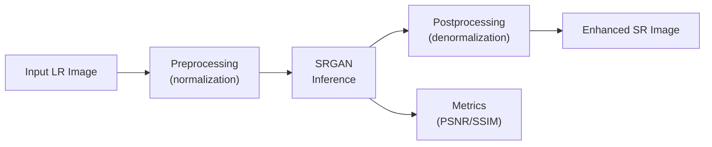

# Stage 6: System Integration and Scalability Analysis

**Status:** ⏳ Pending

## Objective

Assess deployment feasibility and design the inference pipeline. Plan the architecture for integrating the super-resolution model into a production-ready system.

---

## Planned Components

## Deployment Options (To Explore)

### Option 1: REST API (Recommended)
- **Framework:** FastAPI or Flask
- **Endpoint:** `POST /enhance`
- **Input:** Multipart image upload
- **Output:** Enhanced image + metrics JSON
- **Container:** Docker for portability

### Option 2: Web Integration
- **Frontend:** Simple web interface for uploading retinal images
- **Backend:** TorchServe or custom inference server
- **Use case:** Clinical trial visualization

### Option 3: Batch Processing Script
- **Currently available** via notebook inference pipeline
- Suitable for research and validation studies

---

## Performance Benchmarks (To Measure)

| Metric | Current (GTX 1650) | Target |
|--------|:------------------:|:------:|
| Inference time (×2) | TBD | <500ms |
| Inference time (×4) | TBD | <1s |
| Memory footprint | ~1.6 GB | <2 GB |
| Model size | ~2-6 MB | <10 MB |

---

## Scalability Considerations

- **Model quantization** (FP16/INT8) for faster inference
- **ONNX export** for cross-platform deployment
- **Batch inference** for handling multiple images
- **GPU vs CPU inference** tradeoffs for clinical settings

---

## Deliverables

- [ ] Inference script
- [ ] Performance benchmarks
- [ ] Deployment feasibility report
